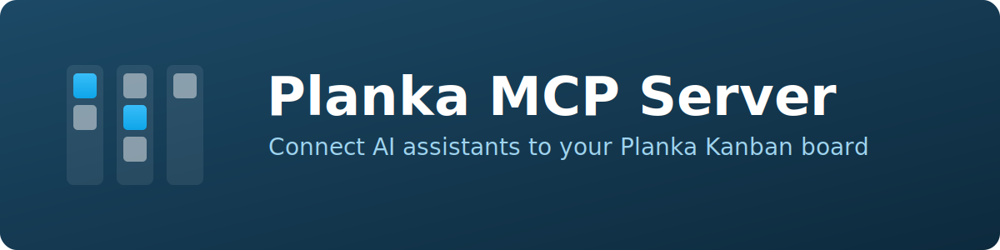

<p align="center">
  
</p>

<p align="center">
  A <a href="https://modelcontextprotocol.io">Model Context Protocol</a> server that exposes a
  <a href="https://planka.app">Planka</a> instance — projects, boards, cards, comments, attachments and more — to MCP clients.
</p>

<p align="center">
  
  
  
</p>

---

## Features

- **Full Planka coverage** — grouped tools for auth, projects, boards, lists, cards, comments, tasks and labels, plus optional and admin categories.
- **Two transports** — `stdio` (for desktop MCP clients) and `SSE` (HTTP, for remote clients), selectable via one env var.
- **Flexible auth** — username/password (with cached, auto-refreshed bearer tokens) or a static Planka API key.
- **Resilient forwarding** — context-aware HTTP retries with exponential backoff, and server-side URL-fetch uploads via multipart.
- **Zero third-party dependencies** — pure Go standard library.

## Install

```bash
go install github.com/adambenhassen/planka-mcp-go/cmd/planka-mcp@latest
```

Or build from source:

```bash
git clone https://github.com/adambenhassen/planka-mcp-go.git
cd planka-mcp-go
go build ./cmd/planka-mcp
```

## Configuration

All configuration is via environment variables:

| Variable | Default | Description |
| --- | --- | --- |
| `PLANKA_BASE_URL` | `http://localhost:3000` | Planka base URL (without the `/api` suffix). |
| `PLANKA_USERNAME` | — | Login username/email for password auth. |
| `PLANKA_PASSWORD` | — | Login password for password auth. |
| `PLANKA_API_KEY` | — | Static API key; used instead of username/password when set. |
| `MCP_TRANSPORT` | `stdio` | Transport to serve: `stdio` or `sse`. |
| `MCP_PORT` | `3001` | HTTP port for the `sse` transport. |
| `ENABLE_ADMIN_TOOLS` | `false` | Enable the admin tool category (`true`). |
| `ENABLE_OPTIONAL_TOOLS` | `false` | Enable the optional tool category (`true`). |
| `ENABLE_ALL_TOOLS` | `false` | Enable every category (`true`). |
| `PLANKA_HTTP_MAX_RETRIES` | `2` | Max HTTP retry attempts. |
| `PLANKA_HTTP_RETRY_BASE_DELAY_MS` | `250` | Base delay for retry backoff, in milliseconds. |

Provide **either** `PLANKA_USERNAME` + `PLANKA_PASSWORD` **or** `PLANKA_API_KEY`.

## Usage

### stdio (desktop MCP clients)

Add it to your client's MCP config — for example, Claude Desktop:

```json
{
  "mcpServers": {
    "planka": {
      "command": "planka-mcp",
      "env": {
        "PLANKA_BASE_URL": "http://localhost:3000",
        "PLANKA_USERNAME": "demo@demo.demo",
        "PLANKA_PASSWORD": "demo"
      }
    }
  }
}
```

### SSE (remote / HTTP)

```bash
MCP_TRANSPORT=sse MCP_PORT=3001 \
PLANKA_BASE_URL=http://localhost:3000 \
PLANKA_API_KEY=your-key \
planka-mcp
```

The server then exposes the SSE endpoint and a health check on the configured port.

## Tools

Tools are grouped by category; each is a single MCP tool with an `action` selector.

| Category | Enabled by | Tools |
| --- | --- | --- |
| **Core** | always | `auth`, `projects`, `boards`, `lists`, `cards`, `comments`, `tasks`, `labels`, `bootstrap` |
| **Optional** | `ENABLE_OPTIONAL_TOOLS` | `actions`, `attachments`, `notifications` |
| **Admin** | `ENABLE_ADMIN_TOOLS` | `config`, `users`, `webhooks` |

## Development

```bash
go build ./...              # build
go test ./...               # run the test suite
go test -race ./...         # with the race detector
golangci-lint run           # lint
```

## Credits

Based on the original [`planka-mcp`](https://github.com/adambenhassen/planka-mcp) server.
